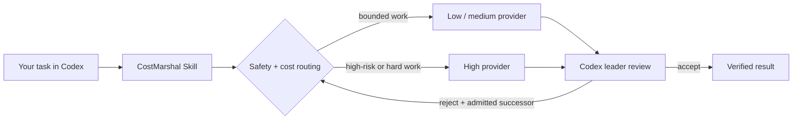

<div align="center">
  

  <h1>CostMarshal</h1>

  <p><strong>Give every task the right model—not the most expensive model.</strong></p>
  <p>Codex-native orchestration across low-, medium-, and high-cost API providers, with durable recovery, budget guardrails, and leader-owned acceptance.</p>

  <p>
    <a href="https://github.com/yptang98/CostMarshal/actions/workflows/ci.yml"></a>
    <a href="VERSION"></a>
    <a href="https://www.python.org/downloads/"></a>
    <a href="LICENSE"></a>
  </p>

  <p>
    <a href="#install-with-one-codex-prompt">Install</a> ·
    <a href="#use-it">Use it</a> ·
    <a href="#how-it-works">How it works</a> ·
    <a href="#providers">Providers</a> ·
    <a href="#documentation">Documentation</a>
  </p>
</div>

---

## Install with one Codex prompt

Open Codex, paste this, and let Codex handle the installation and validation:

```text
Install CostMarshal from https://github.com/yptang98/CostMarshal.
Follow INSTALL_PROMPT.md exactly: pin the reviewed commit, preserve my existing
runtime state and secrets, validate the plugin, then tell me how to use it from
Codex without requiring Python or CostMarshal CLI commands.
```

That prompt covers both a first install and an existing pinned installation. Start a new Codex task afterward so the plugin Skill is discovered.

> [!NOTE]
> The hidden runtime requires Python 3.11+. Git is required for writable worker worktrees. Production worker isolation additionally requires Docker or Podman with Linux containers.

<details>
<summary><strong>Prefer to install manually?</strong></summary>

The recommended path is the prompt above. For a reviewed, commit-pinned first install:

```powershell
codex plugin marketplace add yptang98/CostMarshal --ref <reviewed-40-character-commit>
codex plugin add costmarshal@costmarshal
codex plugin list --json
```

For updates, follow [`INSTALL_PROMPT.md`](INSTALL_PROMPT.md). It preserves both current and legacy runtime roots and replaces only the pinned plugin snapshot.

</details>

## Use it

CostMarshal is designed to be operated in natural language:

```text
Use CostMarshal to complete this task with the best cost-quality tradeoff
across low, medium, and high APIs.
```

You can also invoke the Skill explicitly:

```text
$orchestrate-cost-aware-agents plan and execute this task within a 30 CNY budget.
```

No Python commands are required for normal use.

## Why CostMarshal

| | Capability | What it gives you |
| :---: | --- | --- |
| 💸 | Cost-aware routing | Chooses the safest economical provider chain from reviewed prices, token forecasts, and acceptance history. |
| 🧭 | Three capability tiers | Routes bounded work across low, medium, and high tiers without tying policy to one vendor. |
| 🛡️ | Safety floors | Risk, difficulty, task type, and required capabilities can raise the minimum tier; cost never lowers it. |
| ✅ | Leader-owned acceptance | Workers report results, but only the Codex leader can accept, reject, continue, or apply changes. |
| ♻️ | Durable recovery | Actors, attempts, mailboxes, budgets, reports, and recovery state survive interrupted sessions. |
| 🔒 | Bounded execution | Write claims, sealed routes, generation fencing, and optional OCI isolation constrain worker scope. |

## How it works



1. **Plan** — Codex turns the request into bounded tasks, write scopes, budgets, and acceptance criteria.
2. **Route** — CostMarshal applies a fail-closed safety floor, then compares valid non-decreasing provider chains.
3. **Execute** — A task-scoped actor receives only its bound prompt, provider profile, and allowed paths.
4. **Review** — The Codex leader inspects sealed evidence and explicitly accepts or rejects the attempt.
5. **Recover** — Durable on-disk state allows the scheduler to resume without relying on chat memory.

### Routing at a glance

| Work profile | Minimum tier |
| --- | :---: |
| Low-risk bounded analysis, extraction, docs, tests, verification, or small edits | **Low** |
| Medium risk, implementation, review, or code review | **Medium** |
| High risk or hard difficulty | **High** |
| Unknown or judgment-heavy work | **Medium** |

New projects default to `completion-first`: the admitted route retains a strongest-compatible terminal fallback, while acceptance at an earlier step stops further spend. Provider repetition and tier downgrade are always rejected.

<details>
<summary><strong>Routing and budget model</strong></summary>

When enabled providers have reviewed prices and the task includes non-zero token estimates, CostMarshal evaluates every valid non-decreasing chain of one to three distinct providers:

```text
expected_chain_cost = C1 + (1-P1)C2 + (1-P1)(1-P2)C3
success_probability = 1 - product(1-Pi)
objective = expected_chain_cost / success_probability
```

`Pi` comes only from explicit leader acceptance records. Missing pricing or token estimates never produce an invented cost; routing falls back to the minimum safe tier, and budgeted dispatch fails closed if it cannot form an eligible estimate.

CostMarshal reserves the full admitted chain estimate before first dispatch. Every step binds its own token forecast, reviewed price snapshot, provider identity, profile hash, and acceptance evidence. A rejected result can continue only to the exact next provider in the sealed route, and only after explicit leader authorization.

For the complete routing and accounting contract, read the repository-level [`SKILL.md`](SKILL.md) and inspect the CLI help.

</details>

## Providers

The default catalog establishes three replaceable capability tiers:

| Provider ID | Tier | Default profile | Credential variable |
| --- | :---: | --- | --- |
| `longcat` | Low | `longcat` | `LONGCAT_API_KEY` |
| `deepseek` | Medium | `deepseek` | `DEEPSEEK_API_KEY` |
| `codex` | High | built-in Codex provider | `CODEX_API_KEY` |

Ask Codex to configure a provider without exposing its key:

```text
Configure CostMarshal for my low-, medium-, and high-tier providers.
Keep credentials outside actor workspaces, never print secret values, and
validate every profile and reviewed pricing snapshot before routing work.
```

Provider identity is separate from capability tier, so the catalog can be replaced without changing routing policy. Credentials are supplied through the process environment or an external secrets file; they are not written into profiles, prompts, reports, or repository files.

<details>
<summary><strong>Provider profile and catalog setup</strong></summary>

The internal CLI can create Codex profiles without storing API keys:

```powershell
python scripts/costmarshal.py configure-profiles

python scripts/costmarshal.py configure-provider `
  --profile deepseek `
  --provider-id deepseek `
  --display-name "DeepSeek" `
  --base-url "https://your-reviewed-provider-endpoint/v1" `
  --model "your-reviewed-model" `
  --env-key DEEPSEEK_API_KEY
```

Budgeted routing requires a hash-bound pricing snapshot for each enabled provider. Use `costmarshal_v2.routing.build_pricing_snapshot(...)` to canonicalize reviewed CNY rates and timestamps; do not hand-edit snapshot hashes. Expired, future-effective, mixed-currency, malformed, or incomplete pricing fails closed.

The home directory resolution order is an explicit `--codex-home`, then non-empty `CODEX_HOME`, then `~/.codex`. Service and container launches should use an absolute `CODEX_HOME`.

</details>

## Safety and trust boundary

> [!IMPORTANT]
> OCI isolation protects the host workspace and keeps non-selected provider keys out of a worker. It cannot hide the selected provider credential from the provider client inside that same container. Use dedicated, least-privilege, spend-capped, revocable keys and a reviewed digest-pinned worker image.

- Production workers require an attested Docker/Podman Linux-container boundary and never silently fall back to a native process.
- Workers cannot accept results, authorize additional provider spend, broaden their write scope, or apply their own changes.
- Writable changes are previewed in a detached Git worktree and verified by path, blob, and executable mode before explicit application.
- Budget controls are admission and accounting limits over reviewed estimates—not a guarantee that an already-started external API call cannot exceed its forecast.
- Real-provider backtests and live malicious-container evidence are still required for deployment-specific production certification. Local and mocked tests are not treated as that proof.

Read [`SECURITY.md`](SECURITY.md) before production use.

## Architecture

| Component | Responsibility | Boundary |
| --- | --- | --- |
| **Codex Skill** | Converts natural-language intent into bounded orchestration | Normal user-facing product surface |
| **Scheduler** | Relays messages, enforces locks, records state, and launches fenced effects | Never plans, reviews, or calls a model itself |
| **Leader** | Plans, reviews, integrates, and accepts at explicit gates | Runs on demand; does not become a hidden default worker |
| **Worker** | Executes one bounded attempt with a specific provider and scope | Cannot broaden context, mutate control state, or self-authorize continuation |

CostMarshal stores project state under `$CODEX_HOME/costmarshal-v2` when `CODEX_HOME` is set, otherwise under `~/.codex/costmarshal-v2`. The plugin snapshot is curated from an explicit allowlist and excludes repository metadata, development tests, generated artifacts, legacy interfaces, and secret-bearing files.

## Documentation

| Document | Use it for |
| --- | --- |
| [`INSTALL_PROMPT.md`](INSTALL_PROMPT.md) | Commit-pinned install or update through Codex |
| [`SKILL.md`](SKILL.md) | Canonical orchestration policy and operating contract |
| [`SECURITY.md`](SECURITY.md) | Threat model, isolation guarantees, and limitations |
| [`references/migration-v3.md`](references/migration-v3.md) | Migrating v2 projects and standalone Skill installs |
| [`references/protocol.md`](references/protocol.md) | Actor, mailbox, task, and acceptance protocol |
| [`references/storage.md`](references/storage.md) | Durable state layout and storage semantics |
| [`references/backtest.md`](references/backtest.md) | Blind real-provider evaluation format and gates |
| [`container/worker/README.md`](container/worker/README.md) | Building the digest-pinned worker image |
| [`CHANGELOG.md`](CHANGELOG.md) | Release history |

<details>
<summary><strong>Internal CLI, recovery, and validation</strong></summary>

The Python CLI is an internal runtime, automation, recovery, and diagnostic surface:

```powershell
python scripts/costmarshal.py --help
python scripts/costmarshal.py route --help
python scripts/costmarshal.py dashboard --help
python scripts/costmarshal.py recover --help
```

Existing projects remain on legacy JSON/JSONL authority until an explicit offline SQLite WAL cutover. Preview migration first, stop live actors, preserve the generated backup, and apply only after validation:

```powershell
python scripts/costmarshal.py migrate-state --project <project-dir>
python scripts/costmarshal.py migrate-state --project <project-dir> --apply
python scripts/costmarshal.py state-store --project <project-dir>
```

Required OCI actors must cut over before `dispatch --start`, ensuring every production container start has a recoverable STOP-effect path.

</details>

<details>
<summary><strong>Development verification</strong></summary>

CI runs the complete SHA-bound local evidence suite on Windows and Linux with Python 3.11 and 3.13:

```powershell
python scripts/sync_plugin_package.py
python tests/release/run_local_test_evidence.py
```

Non-beta release evidence additionally requires preregistered trust roots, an attested real-provider blind dataset, and a reviewed live OCI/provider-proxy topology. Without those external inputs, a `blocked` report is the expected safe outcome.

</details>

## Compatibility

CostMarshal can work alongside [ArchMarshal](https://github.com/yptang98/ArchMarshal) through explicit, read-only governance binding checks. It never adopts a workspace, applies an ArchMarshal plan, starts or ends a managed session, or edits ArchMarshal automatically.

Legacy v2 state remains auditable and is never silently rewritten. See the [v3 migration guide](references/migration-v3.md).

## License

[MIT](LICENSE) © yptang98
