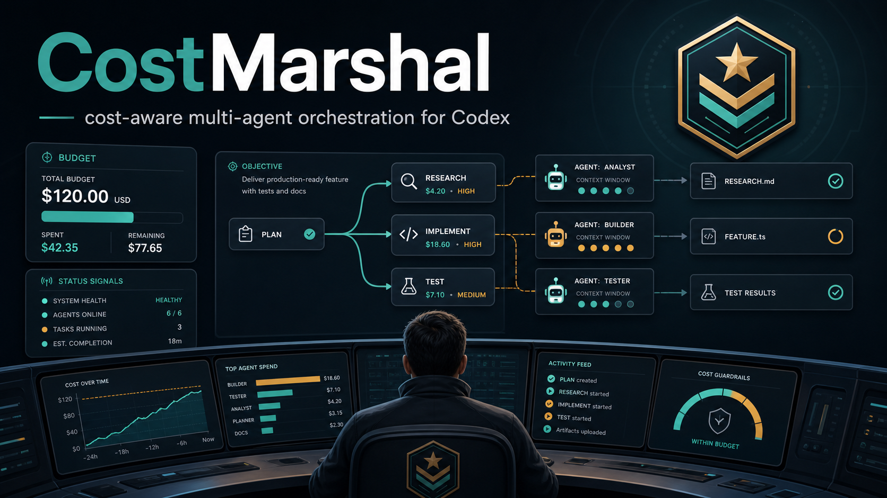

<p align="center">
  
</p>

# CostMarshal v2

<p align="center">
  
  
  
  
  
  
</p>

CostMarshal v2 is the official scheduler-first line of CostMarshal: a durable
control plane for Codex CLI that coordinates leader and worker agents without
letting the leader context become a crowded dumping ground.

The leader model stays responsible for planning, routing, verification,
integration, and final acceptance. Task-scoped agent actors work from bounded
briefs, communicate through durable mailboxes, and leave structured reports,
token/cost records, write locks, and recovery state behind.

Version: `v2.0.0`

GitHub: https://github.com/yptang98/CostMarshal

## Official v2 Line

v2 replaces the old monolithic runtime as the product line. The official entry
point is:

```bash
python scripts/costmarshal.py ...
```

That wrapper loads the `costmarshal_v2` package. The old v1 engine remains in
`scripts/mc.py` only as legacy reference material for existing users who
intentionally call it directly.

## Why CostMarshal

Long Codex sessions are easy to make expensive and hard to audit:

- the strongest model starts reading every log, file, and worker transcript
- cheap models receive too much context and improvise outside their ability
- task ownership and write scopes become blurry
- terminal or network disconnects lose what each agent was supposed to do
- token/cost records and final acceptance decisions are scattered

CostMarshal v2 turns this into a software-engineered workflow:

- **Scheduler-first control plane:** the scheduler relays messages, launches
  actors, records events, and audits recovery; it does not plan or review.
- **Durable actors:** the leader and every worker have prompt files, mailbox
  files, runtime state, and task bindings on disk.
- **Leader discipline:** direct leader implementation-like work must be
  recorded with reason, scope, time, token estimates, and cost.
- **Task-scoped workers:** agents get a bounded brief, explicit context, and
  allowed write paths.
- **Write-lock safety:** active `--claim-path` overlaps are rejected unless the
  leader explicitly overrides them.
- **Cost visibility:** `record-result` and `record-leader-work` preserve input
  tokens, output tokens, total tokens, estimated CNY cost, quality, and
  acceptance.
- **Recovery by files, not memory:** prompts, mailboxes, status files, and
  backend runtime metadata are enough to resume after interruption.

## Install By Codex Prompt

The same prompt is available in [`INSTALL_PROMPT.md`](INSTALL_PROMPT.md).

Open a Codex session and paste:

```text
Install CostMarshal from https://github.com/yptang98/CostMarshal into my Codex skills directory.

Requirements:
- Clone or download https://github.com/yptang98/CostMarshal.
- Resolve the Codex skills directory: $CODEX_HOME/skills if CODEX_HOME is set, otherwise ~/.codex/skills.
- If costmarshal is not installed, copy the skill folder to <skills-dir>/costmarshal.
- If <skills-dir>/costmarshal already exists, treat this as an update:
  - Read <skills-dir>/costmarshal/VERSION if it exists and report the old version.
  - Move the old installed skill folder to <skills-dir>/costmarshal.backup-<timestamp>.
  - Copy the new CostMarshal skill folder to <skills-dir>/costmarshal.
  - Do not copy .git, __pycache__, .env files, local runtime folders, or secret files.
  - Preserve $CODEX_HOME/costmarshal-v2 or ~/.codex/costmarshal-v2 runtime state exactly as-is.
  - Preserve legacy $CODEX_HOME/costmarshal or ~/.codex/costmarshal runtime state exactly as-is.
  - Preserve local secret files exactly as-is; do not print secret values.
- Do not copy any local .env files or secrets.
- Verify Python 3.10+ is available with: python --version
- If python is unavailable on Windows, try: py -3 --version
- CostMarshal v2 uses scheduler actors and pluggable runtime backends; do not run legacy v1 initialization unless I explicitly ask for it.
- Run: python <installed-skill>/scripts/costmarshal.py --help
- Run: python <installed-skill>/scripts/costmarshal.py init --name install-smoke --objective "Validate CostMarshal v2 install" --backend local
- Run: python <installed-skill>/scripts/costmarshal.py validate --project <created-project-dir>
- Tell me I can invoke it with `$costmarshal`, for example: `$costmarshal start a new Arbor project for ...`
- Run skill validation if quick_validate.py is available.
- Report the installed path, old version if updated, new version, backup path if created, and validation result.
```

After install, restart Codex if the skill list is cached.

## Invoke In Codex

Use the skill directly:

```text
$costmarshal start a new scheduler-first research project. Create the v2 project, start the leader in dry-run mode first, create bounded agent tasks, and keep all communication through durable mailboxes.
```

Natural language works too:

```text
Use CostMarshal v2 for this long task. Keep the leader as planner/reviewer, dispatch bounded worker actors, record final acceptance, and preserve recovery state.
```

## Quick Start

```bash
python scripts/costmarshal.py init --name demo --objective "Try scheduler-first orchestration" --backend auto
python scripts/costmarshal.py start-leader --project <project-id> --command "codex --prompt {prompt_file}" --dry-run
python scripts/costmarshal.py new-task --project <project-id> --title "Inspect baseline" --purpose "Return a bounded report" --claim-path reports/baseline.md
python scripts/costmarshal.py dispatch --project <project-id> --task V2-0001 --model gpt-5 --command "codex --model {model} --prompt {prompt_file}" --dry-run
python scripts/costmarshal.py dispatch --project <project-id> --task V2-0001 --model gpt-5 --command "codex --model {model} --prompt {prompt_file}" --start
python scripts/costmarshal.py send --project <project-id> --to leader --message "Task V2-0001 is dispatched."
python scripts/costmarshal.py relay --project <project-id> --actor leader
python scripts/costmarshal.py collect --project <project-id> --task V2-0001 --state waiting_leader --summary "Worker report is ready for leader review"
python scripts/costmarshal.py record-result --project <project-id> --task V2-0001 --status done --quality-score 4 --accepted-by-leader --summary "Accepted after evidence check"
python scripts/costmarshal.py record-leader-work --project <project-id> --task V2-0001 --work-type verification --risk low --scope "Sampled evidence" --reason "Leader acceptance requires review"
python scripts/costmarshal.py stop-actor --project <project-id> --actor agent-v2-0001 --reason "task complete"
python scripts/costmarshal.py status --project <project-id>
python scripts/costmarshal.py recover --project <project-id> --plan-restarts
python scripts/costmarshal.py validate --project <project-id>
```

Use `--root <dir>` or `COSTMARSHAL_V2_HOME` to choose the runtime root. Default
storage is `$CODEX_HOME/costmarshal-v2` when `CODEX_HOME` is set, otherwise
`~/.codex/costmarshal-v2`.

## Architecture

v2 models each project as durable actors:

| Actor | Responsibility | Must Not Do |
| --- | --- | --- |
| `scheduler` | Relay mailboxes, start/stop runtimes, write state, enforce locks, audit recovery | Plan, implement, review, summarize raw reasoning |
| `leader` | Define goals, split tasks, route agents, verify reports, accept/retry/escalate | Become the hidden default worker |
| `agent-*` | Execute one bounded task from its brief and explicit context | Broaden context, change write scope, expose secrets, make architecture decisions |

Actor execution is backend-driven:

| Backend | Intended Hosts | Behavior |
| --- | --- | --- |
| `auto` | Default | Windows uses `local`; macOS/Linux use `tmux` when available, otherwise `local` |
| `local` | Windows, CI, minimal shells | Starts detached local processes and records pid/log paths |
| `tmux` | Unix servers with tmux | Starts one actor per tmux window and supports runtime text injection |

## Runtime State

```text
<runtime-root>/
  projects/<project-id>/
    project.json
    PROTOCOL.md
    scheduler/
      session.json
      events.jsonl
      relay-cursors.json
      actors/
        leader.json
        leader.prompt.md
        agent-v2-0001.json
        agent-v2-0001.prompt.md
      mailboxes/
        leader/
          inbox.jsonl
          outbox.jsonl
        agent-v2-0001/
          inbox.jsonl
          outbox.jsonl
    tasks/
      V2-0001/
        task.json
        brief.md
        status.json
        completion-report.md
    reports/
      results.jsonl
      leader-work.jsonl
    transcripts/
    locks/
      claims.json
```

If a session is interrupted, restart or recover from these files rather than
from chat memory.

## Command Reference

| Command | Purpose |
| --- | --- |
| `init` | Create a v2 project, scheduler state, leader actor, protocol file, and backend config |
| `start-leader` | Start or dry-run the persistent leader actor |
| `new-task` | Create a bounded task with brief, status, report template, context, and write claims |
| `dispatch` | Bind a task to an agent actor and optionally start that actor |
| `send` | Write a durable mailbox message, optionally injecting it into the runtime |
| `relay` | Relay actor-authored outbox messages using durable cursors |
| `heartbeat` | Record actor liveness and advance running task state |
| `collect` | Mark a worker report ready for leader review |
| `record-result` | Record leader acceptance/rejection, quality, token usage, and cost |
| `record-leader-work` | Audit direct leader implementation-like work |
| `stop-actor` | Mark an actor stopped and optionally stop its runtime process |
| `recover` | Audit missing prompts, mailboxes, runtimes, and restart plans |
| `status` | Show actors, mailboxes, relay cursors, results, leader work, locks, and tasks |
| `validate` | Validate v2 project structure and ledger consistency |

## Leader Discipline

The leader should plan, route, verify, integrate, and accept. It should not
silently become the default worker. If the leader performs direct
implementation-like work, record it immediately:

```bash
python scripts/costmarshal.py record-leader-work --project <project-id> --task V2-0001 --work-type integration --risk low --scope "Small final glue edit" --reason "Delegation would add coordination risk"
```

After every worker attempt, record the leader's final evaluation:

```bash
python scripts/costmarshal.py record-result --project <project-id> --task V2-0001 --status done --quality-score 4 --accepted-by-leader --summary "Accepted after evidence check"
```

`status` surfaces both ledgers:

- worker result records: accept rate, quality, input/output tokens, estimated cost
- leader self-work records: reason, risk, minutes, input/output tokens, estimated cost

## Existing Projects

Use `init --source-project <path>` to bring an already-running project under v2
control without mutating that source project:

```bash
python scripts/costmarshal.py init --name adopted-run --objective "Continue this existing run under v2 control" --source-project <existing-project> --backend auto
```

The source project is treated as read-only reference material. v2 writes its
own project state under the CostMarshal v2 runtime root.

## Design Boundary

CostMarshal v2 is deliberately scheduler-first. The scheduler is not another
thinking agent; it is a small durable control plane. The leader remains
responsible for decisions, while worker actors remain responsible for bounded
task work and structured reports.

This boundary is what makes the system useful for long tasks: the leader can
stay clean and decisive, workers can be restarted or replaced, and the project
can be audited from disk.

## Validation

Run these checks before publishing or after changing the runtime:

```bash
python tests/unit_test.py
python tests/smoke_test.py
python tests/local_backend_contract_test.py
python tests/tmux_contract_test.py
python scripts/install_smoke_test.py
```

PowerShell compile check:

```powershell
$files = @('scripts/costmarshal.py') + (Get-ChildItem -Path 'costmarshal_v2','tests','scripts' -Filter '*.py' | ForEach-Object { $_.FullName })
python -m py_compile @files
```

## Repository Metadata

Suggested GitHub description:

```text
Scheduler-first, cost-aware multi-agent orchestration for Codex CLI with durable actors, mailboxes, write locks, recovery, and leader acceptance ledgers.
```

Suggested GitHub topics:

```text
codex, codex-cli, multi-agent, ai-agents, agent-orchestration, cost-aware-ai, scheduler, tmux, llmops, research-automation
```

## License

MIT License. See [LICENSE](LICENSE).

## Acknowledgements

CostMarshal is inspired in part by [Jinghao67/conductor](https://github.com/Jinghao67/conductor)
and the model-hierarchy-skill approach to tiered model collaboration.
