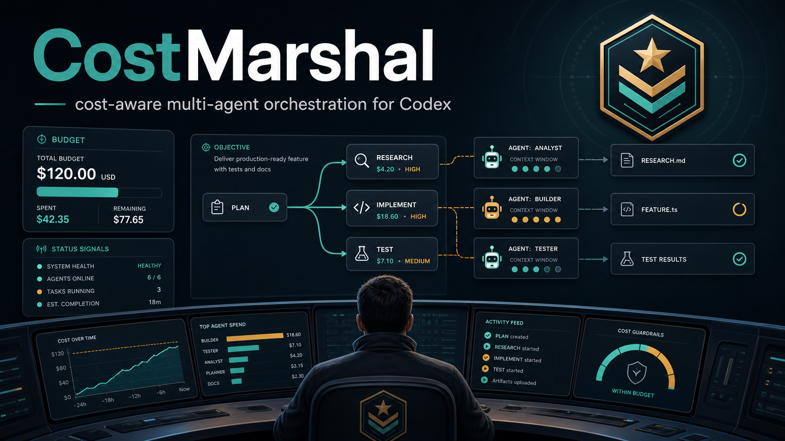
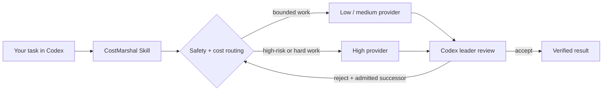

<div align="center">
  

  <h1>CostMarshal</h1>

  <p><strong>Give every task the right model—not the most expensive model.</strong></p>
  <p>Codex-native orchestration across low-, medium-, and high-cost API providers, with durable recovery, budget guardrails, and leader-owned acceptance.</p>

  <p>
    <a href="https://github.com/yptang98/CostMarshal/actions/workflows/ci.yml"></a>
    <a href="VERSION"></a>
    <a href="https://www.python.org/downloads/"></a>
    <a href="LICENSE"></a>
  </p>

  <p>
    <a href="#install-with-one-codex-prompt">Install</a> ·
    <a href="#use-from-codex">Use it</a> ·
    <a href="#how-it-works">How it works</a> ·
    <a href="#providers">Providers</a> ·
    <a href="#documentation">Documentation</a>
  </p>
</div>

---

## Install with one Codex prompt

Open Codex, paste this, and let Codex handle the installation and validation:

```text
Install CostMarshal from https://github.com/yptang98/CostMarshal.
Follow INSTALL_PROMPT.md exactly: pin the reviewed commit, preserve my existing
runtime state and secrets, validate the plugin, then tell me how to use it from
Codex without requiring Python or CostMarshal CLI commands.
```

That prompt covers both a first install and an existing pinned installation. Start a new Codex task afterward so the plugin Skill is discovered.

> [!NOTE]
> The hidden runtime requires Python 3.11+. Git is required for writable worker worktrees. Production worker isolation additionally requires Docker or Podman with Linux containers.

<details>
<summary><strong>Prefer to install manually?</strong></summary>

The recommended path is the prompt above. For a reviewed, commit-pinned first install:

```powershell
codex plugin marketplace add yptang98/CostMarshal --ref <reviewed-40-character-commit>
codex plugin add costmarshal@costmarshal
codex plugin list --json
```

For updates, follow [`INSTALL_PROMPT.md`](INSTALL_PROMPT.md). It preserves both current and legacy runtime roots and replaces only the pinned plugin snapshot.

</details>

## Use from Codex

CostMarshal is designed to be operated in natural language:

```text
Use CostMarshal to complete this task with the best cost-quality tradeoff
across low, medium, and high APIs.
```

You can also invoke the Skill explicitly:

```text
$orchestrate-cost-aware-agents plan and execute this task within a 30 CNY budget.
```

No Python commands are required for normal use. The CLI is retained for
runtime, recovery, automation, and diagnostics—not as a requirement for ordinary users.

## Why CostMarshal

| | Capability | What it gives you |
| :---: | --- | --- |
| 💸 | Cost-aware routing | Chooses the safest economical provider chain from reviewed prices, token forecasts, and acceptance history. |
| 🧭 | Three capability tiers | Routes bounded work across low, medium, and high tiers without tying policy to one vendor. |
| 🛡️ | Safety floors | Risk, difficulty, task type, and required capabilities can raise the minimum tier; cost never lowers it. |
| ✅ | Leader-owned acceptance | Workers report results, but only the Codex leader can accept, reject, continue, or apply changes. |
| ♻️ | Durable recovery | Actors, attempts, mailboxes, budgets, reports, and recovery state survive interrupted sessions. |
| 🔒 | Bounded execution | Write claims, sealed routes, generation fencing, and optional OCI isolation constrain worker scope. |
| 🧠 | Evidence-backed evolution | Work graphs, artifact gates, six-dimensional scoring, model memory, and staged policy promotion improve later routing without self-authorizing changes. |
| 📦 | Project continuity | Transcript-free Leader Snapshots, structured handoffs, atomic batch acceptance, and immutable artifact lineage keep long projects moving. |
| 📚 | Accepted knowledge | Charter, architecture, ADR, interface, fact, risk, and milestone indexes can only come from accepted evidence or an explicit Leader decision. |

Total-cost reports complement routing estimates with observable project
economics: known monetary cost per accepted Artifact, execution and review
tokens/time, retries, handoffs, Leader attention, and failure/recovery counts.
Unknown costs remain explicit; CostMarshal never assigns invented prices to
time, tokens, or context.

## How it works


```mermaid
flowchart LR
    A[Your task in Codex] --> B[CostMarshal Skill]
    B --> C{Safety + cost routing}
    C -->|bounded work| D[Low / medium provider]
    C -->|high-risk or hard work| E[High provider]
    D --> F[Codex leader review]
    E --> F
    F -->|accept| G[Verified result]
    F -->|reject + admitted successor| C
```

1. **Plan** — Codex turns the request into bounded tasks, write scopes, budgets, and acceptance criteria.
2. **Route** — CostMarshal applies a fail-closed safety floor, then compares valid non-decreasing provider chains.
3. **Execute** — A task-scoped actor receives only its bound prompt, provider profile, and allowed paths.
4. **Review** — The Codex leader inspects sealed evidence and explicitly accepts or rejects the attempt.
5. **Recover** — Durable on-disk state allows the scheduler to resume without relying on chat memory.
6. **Learn** — Accepted and rejected attempts become auditable evaluations; aggregate model profiles inform later routing and teaching decisions.

Project continuity does not take over your global workspace. CostMarshal keeps
only current-project metadata: small local artifacts remain in place and are
referenced by hash; large outputs remain on external storage; summaries and
Skill candidates retain explicit lineage. CostMarshal never installs global
Skills or moves source project files.

Repeated successes can become a project-local Skill Candidate with explicit
applicability, inputs, steps, verification, failure boundaries, and evidence.
Export is a separate user-triggered preview/apply action that materializes only
inside the CostMarshal project; installation remains the responsibility of an
external reviewed Skill-management workflow.

### Routing at a glance

| Work profile | Minimum tier |
| --- | :---: |
| Low-risk bounded analysis, extraction, docs, tests, verification, or small edits | **Low** |
| Medium risk, implementation, review, or code review | **Medium** |
| High risk or hard difficulty | **High** |
| Unknown or judgment-heavy work | **Medium** |

New projects default to `completion-first`: the admitted route retains a strongest-compatible terminal fallback, while acceptance at an earlier step stops further spend. Provider repetition and tier downgrade are always rejected.

<details>
<summary><strong>Routing and budget model</strong></summary>

When enabled providers have reviewed prices and the task includes non-zero token estimates, CostMarshal evaluates every valid non-decreasing chain of one to three distinct providers:

```text
expected_chain_cost = C1 + (1-P1)C2 + (1-P1)(1-P2)C3
success_probability = 1 - product(1-Pi)
objective = expected_chain_cost / success_probability
```

`Pi` comes only from audited leader result records. New records use a stricter
quality-aware routing outcome: acceptance, gate passage, quality, and error
severity must all agree. Missing pricing or token estimates never produce an
invented cost; routing falls back to the minimum safe tier, and budgeted
dispatch fails closed if it cannot form an eligible estimate.

CostMarshal reserves the full admitted chain estimate before first dispatch. Every step binds its own token forecast, reviewed price snapshot, provider identity, profile hash, and acceptance evidence. A rejected result can continue only to the exact next provider in the sealed route, and only after explicit leader authorization.

For the complete routing and accounting contract, read the repository-level [`SKILL.md`](SKILL.md) and inspect the CLI help.

</details>

## Providers

CostMarshal includes reviewed API presets for common providers. A preset knows
the endpoint, protocol, key variable, current model, and capabilities—but never
contains a key or an unreviewed price.

| Provider | Included models | API input | CostMarshal input |
| --- | --- | --- | --- |
| DeepSeek | V4 Flash / Pro | Text | Responses gateway required |
| Kimi | K3 / K2.6 | Text, image; K2.6 also video | Responses gateway required |
| LongCat | 2.0 | Text | Text |
| Xiaomi MiMo | 2.5 / 2.5 Pro | 2.5: text, image, audio, video | Text, image |
| Doubao Ark | Seed 2.0 Lite | Text, image, audio, video | Text, image |
| Codex | Native signed-in model | Model-dependent | Text |

Ask Codex to configure the providers and assign tiers without exposing keys:

```text
Configure CostMarshal with DeepSeek, Kimi, LongCat, MiMo, and Doubao as
appropriate. Inspect the built-in provider presets, assign reviewed low/medium/
high tiers, keep credentials outside actor workspaces, and require an exact
input:image capability for tasks that include images.
```

Modern Codex workers use the OpenAI Responses protocol. MiMo and Doubao expose
it officially; this LongCat deployment is live-verified with it. DeepSeek and
Kimi currently document Chat Completions/Anthropic APIs, so CostMarshal reports
their capabilities but refuses to generate a misleading direct Codex profile;
use a separately reviewed Responses gateway for those two.

Multimodal is enforced end to end: routing uses the intersection of the model's
documented API capabilities and what the current worker can actually transport.
Local images are supported and are passed through the immutable task/context
contract; audio and video remain visible as API facts but are not yet routable.
See [`references/providers.md`](references/providers.md) for the exact models,
capability vocabulary, limitations, and official documentation links.

<details>
<summary><strong>Provider profile and catalog setup</strong></summary>

The internal CLI can inspect presets and create profiles without storing API
keys:

```powershell
python scripts/costmarshal.py provider-presets
python scripts/costmarshal.py provider-presets --preset mimo

python scripts/costmarshal.py configure-provider `
  --preset mimo-v2.5 `
  --profile mimo `
  --tier medium
```

Budgeted routing requires a hash-bound pricing snapshot for each enabled provider. Use `costmarshal_v2.routing.build_pricing_snapshot(...)` to canonicalize reviewed CNY rates and timestamps; do not hand-edit snapshot hashes. Expired, future-effective, mixed-currency, malformed, or incomplete pricing fails closed.

Provider identity is separate from capability tier, so the catalog can be
replaced without changing routing policy. Native Codex execution reuses an
actor-private copy of the existing Codex login. Because an isolated OCI worker
must not inherit the host session, its explicit OpenAI API path uses the
standard `OPENAI_API_KEY`. Other provider credentials are supplied through the
process environment or an external secrets file. No credential is written into
profiles, prompts, reports, or repository files.

The home directory resolution order is an explicit `--codex-home`, then non-empty `CODEX_HOME`, then `~/.codex`. Service and container launches should use an absolute `CODEX_HOME`.

</details>

## Safety and trust boundary

> [!IMPORTANT]
> OCI isolation protects the host workspace and keeps non-selected provider keys out of a worker. It cannot hide the selected provider credential from the provider client inside that same container. Use dedicated, least-privilege, spend-capped, revocable keys and a reviewed digest-pinned worker image.

- Production workers require an attested Docker/Podman Linux-container boundary and never silently fall back to a native process.
- Workers cannot accept results, authorize additional provider spend, broaden their write scope, or apply their own changes.
- Writable changes are previewed in a detached Git worktree and verified by path, blob, and executable mode before explicit application.
- Budget controls are admission and accounting limits over reviewed estimates—not a guarantee that an already-started external API call cannot exceed its forecast.
- Real-provider backtests and live malicious-container evidence are still required for deployment-specific production certification. Local and mocked tests are not treated as that proof.

Read [`SECURITY.md`](SECURITY.md) before production use.

## Architecture

| Component | Responsibility | Boundary |
| --- | --- | --- |
| **Codex Skill** | Converts natural-language intent into bounded orchestration | Normal user-facing product surface |
| **Scheduler** | Relays messages, enforces locks, records state, and launches fenced effects | Never plans, reviews, or calls a model itself |
| **Leader** | Plans, reviews, integrates, and accepts at explicit gates | Runs on demand; does not become a hidden default worker |
| **Worker** | Executes one bounded attempt with a specific provider and scope | Cannot broaden context, mutate control state, or self-authorize continuation |
| **Work Graph** | Tracks dependencies, roles, readiness, and accepted joins | A blocked package cannot dispatch |
| **Artifact & Gate Engine** | Registers content-addressed outputs and evaluates deterministic acceptance policy | Leader acceptance cannot override a failed configured gate |
| **Evolution Engine** | Records scores/errors, rebuilds cross-project model profiles, chooses teaching policy, and proposes candidates | Observations never activate policy directly |
| **Cost Engine** | Builds evidence-bound total-cost snapshots per accepted Artifact | Unknown monetary observations remain explicit; time and tokens are never assigned invented prices |

### How self-evolution stays safe

Each completed attempt records quality, efficiency, instruction following,
handoff quality, reliability, routing fit, token/cost variance, and an explicit
error attribution. Cross-project model memory is an aggregate, rebuildable view
over those immutable ledgers; it contains no prompts, reports, summaries, or raw
artifacts. Profiles are isolated by exact provider/model/profile hash and task
scope, publish 95% Wilson intervals, and reduce stale evidence with a 90-day
half-life. Failures attributed to environment, tools, dependencies, budget,
context, routing, or human review remain auditable but do not count as negative
model-capability evidence.

Teaching is selected for cold-start scopes, high-risk work, repeated weak
outcomes, or low-confidence evidence. Automatic teaching is advisory; an
explicit `review`, `paired`, or `replay` policy creates a fixed execution graph
and requires a validated teaching run before enforced acceptance. Review binds
a separate reviewer result, paired mode binds two model identities plus a
comparison, and replay holds model identity and task scope fixed. Learned
recommendations move through
`candidate → replayed → shadow → canary → active`, with explicit review at
every transition. One successful or failed task can never rewrite active
routing policy by itself.

CostMarshal stores project state under `$CODEX_HOME/costmarshal-v2` when `CODEX_HOME` is set, otherwise under `~/.codex/costmarshal-v2`. The plugin snapshot is curated from an explicit allowlist and excludes repository metadata, development tests, generated artifacts, legacy interfaces, and secret-bearing files.

## Documentation

| Document | Use it for |
| --- | --- |
| [`INSTALL_PROMPT.md`](INSTALL_PROMPT.md) | Commit-pinned install or update through Codex |
| [`SKILL.md`](SKILL.md) | Canonical orchestration policy and operating contract |
| [`SECURITY.md`](SECURITY.md) | Threat model, isolation guarantees, and limitations |
| [`references/migration-v3.md`](references/migration-v3.md) | Migrating v2 projects and standalone Skill installs |
| [`references/protocol.md`](references/protocol.md) | Actor, mailbox, task, and acceptance protocol |
| [`references/providers.md`](references/providers.md) | Provider presets, API/runtime capabilities, and multimodal input |
| [`references/storage.md`](references/storage.md) | Durable state layout and storage semantics |
| [`references/evolution.md`](references/evolution.md) | Work graph, evaluation memory, teaching triggers, and policy promotion |
| [`references/backtest.md`](references/backtest.md) | Blind real-provider evaluation format and gates |
| [`container/worker/README.md`](container/worker/README.md) | Building the digest-pinned worker image |
| [`CHANGELOG.md`](CHANGELOG.md) | Release history |

<details>
<summary><strong>Internal CLI, recovery, and validation</strong></summary>

The Python CLI is an internal runtime, automation, recovery, and diagnostic surface:

```powershell
python scripts/costmarshal.py --help
python scripts/costmarshal.py route --help
python scripts/costmarshal.py dashboard --help
python scripts/costmarshal.py work-graph --help
python scripts/costmarshal.py model-memory --help
python scripts/costmarshal.py record-teaching-run --help
python scripts/costmarshal.py cost-report --help
python scripts/costmarshal.py policy-status --help
python scripts/costmarshal.py recover --help
```

Existing projects remain on legacy JSON/JSONL authority until an explicit offline SQLite WAL cutover. Preview migration first, stop live actors, preserve the generated backup, and apply only after validation:

```powershell
python scripts/costmarshal.py migrate-state --project <project-dir>
python scripts/costmarshal.py migrate-state --project <project-dir> --apply
python scripts/costmarshal.py state-store --project <project-dir>
```

Required OCI actors must cut over before `dispatch --start`, ensuring every production container start has a recoverable STOP-effect path.

</details>

<details>
<summary><strong>Development verification</strong></summary>

CI runs the complete SHA-bound local evidence suite on Windows and Linux with Python 3.11 and 3.13:

```powershell
python scripts/sync_plugin_package.py
python tests/release/run_local_test_evidence.py
```

Non-beta release evidence additionally requires preregistered trust roots, an attested real-provider blind dataset, and a reviewed live OCI/provider-proxy topology. Without those external inputs, a `blocked` report is the expected safe outcome.

</details>

## Compatibility

CostMarshal can work alongside [ArchMarshal](https://github.com/yptang98/ArchMarshal) through explicit, read-only governance binding checks. It never adopts a workspace, applies an ArchMarshal plan, starts or ends a managed session, or edits ArchMarshal automatically.

Legacy v2 state remains auditable and is never silently rewritten. See the [v3 migration guide](references/migration-v3.md).

## License

[MIT](LICENSE) © yptang98
